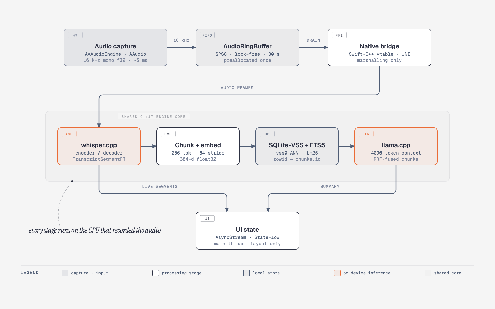
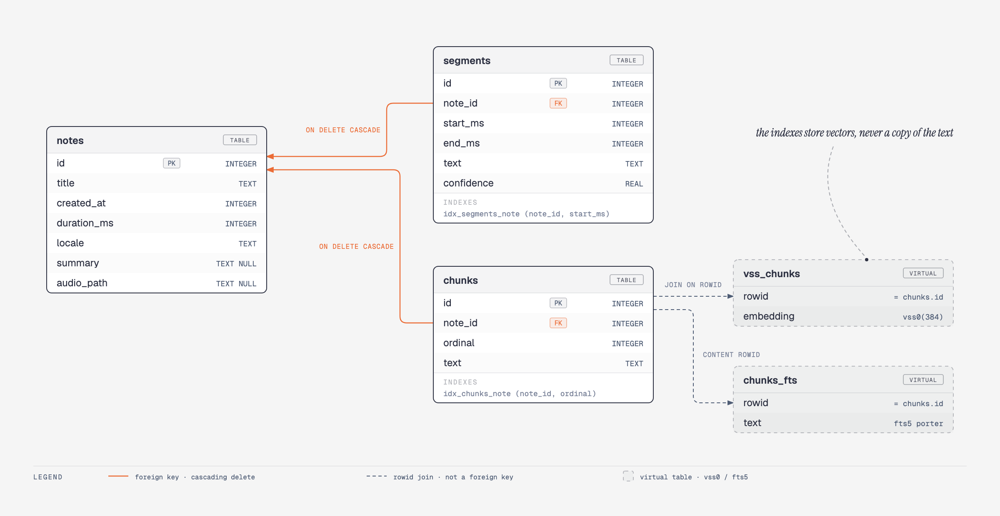

# Scribatic

**Every byte of audio you record stays on the device that recorded it.** Scribatic transcribes speech and answers questions about your own history using `whisper.cpp` and `llama.cpp` executing directly on the phone's CPU. There is no inference endpoint, no telemetry, no crash reporter, no analytics SDK, and no account. The Android build ships without the `INTERNET` permission and the iOS build contains no `URLSession` call site — the app is *structurally* incapable of transmitting a recording, which is a stronger guarantee than any privacy policy. A CI job fails the build if that ever stops being true.

This is a polyglot native monorepo: two fully independent applications — SwiftUI and Jetpack Compose — sharing one C++17 engine core. No JavaScript, no React Native, no Yarn workspaces, no NX.

---

## Contents

- [Data flow topology](#data-flow-topology)
- [Repository layout](#repository-layout)
- [Threading optimisation layer](#threading-optimisation-layer)
- [Memory management layer](#memory-management-layer)
- [Local storage and RAG strategy](#local-storage-and-rag-strategy)
- [The language bridges](#the-language-bridges)
- [Getting started](#getting-started)
- [Make targets](#make-targets)
- [Design decisions](#design-decisions)

---

## Data flow topology

<p align="center">
  
</p>

<sub>Source: [`docs/diagrams/topology.html`](docs/diagrams/topology.html) · vector: [`topology.svg`](docs/diagrams/topology.svg)</sub>

Data crosses each boundary exactly once, in one direction. Nothing in the engine core reaches upward into a UI callback, and nothing in the UI layer can obtain a handle to a `ggml` or `sqlite3` type — those headers are deliberately absent from the iOS module map and from the JNI translation unit.

---

## Repository layout

```
scribatic/
├── Makefile                        Root task orchestrator (the only entry point)
├── core/
│   ├── engine/                     Shared C++17 engine — platform-agnostic
│   │   ├── include/scribatic/core/    PUBLIC surface: the only headers either app sees
│   │   │   ├── EngineInterface.hpp   Facade over whisper/llama/VSS
│   │   │   ├── Types.hpp             Interop-safe value types
│   │   │   ├── AudioRingBuffer.hpp   Lock-free SPSC FIFO
│   │   │   └── ModelResidency.hpp    RAII mmap wrapper for GGUF weights
│   │   ├── src/                    Implementation (EngineImpl.hpp is NOT public)
│   │   ├── tests/                  Dependency-free host test binary
│   │   ├── vendor/                 whisper.cpp + llama.cpp (vendored by setup-all)
│   │   └── CMakeLists.txt
│   └── database/                   Shared SQLite-VSS schema — header-only
│       └── include/scribatic/db/
│           ├── Schema.hpp            DDL: notes, segments, chunks, vss0, fts5
│           ├── Queries.hpp           Prepared-statement text
│           └── Migrations.hpp        Forward-only ladder on PRAGMA user_version
├── apps/
│   ├── ios-swiftui/
│   │   ├── project.yml             XcodeGen spec — the .xcodeproj is an artefact
│   │   ├── ScribaticCore/
│   │   │   └── module.modulemap    The entire Swift ⇄ C++ seam
│   │   └── Sources/Scribatic/
│   │       ├── Engine/             ScribaticEngine actor + value mirrors
│   │       └── UI/                 SwiftUI views, @Observable model
│   └── android-compose/
│       ├── app/build.gradle.kts
│       └── app/src/main/
│           ├── cpp/
│           │   ├── CMakeLists.txt  NDK pipeline: static link, -O3, ARM64 NEON
│           │   └── native-lib.cpp  JNI bridge — marshalling only
│           └── java/com/scribatic/app/
│               ├── engine/         TranscriptionEngine.kt, typed mirrors
│               └── ui/             Compose screens, ViewModel
├── scripts/
│   ├── fetch_models.sh             Pull GGUF weights (never committed)
│   └── verify_no_network.sh        CI guard for the zero-cloud invariant
└── docs/ARCHITECTURE.md            Decision records
```

---

## Threading optimisation layer

A `whisper-base` encode pass occupies a performance core for **200–800 ms** on current flagship silicon. A 120 Hz ProMotion or LTPO panel gives you **8.3 ms** per frame. Those two numbers are the entire design constraint: a single inference pass on the UI thread costs somewhere between 24 and 96 dropped frames, and the user perceives that as the app being broken long before any watchdog fires.

The engine is therefore built so that running inference on a main thread is *awkward to express*, not merely discouraged.

### Three thread classes, three contracts

| Class | Who runs on it | What is permitted |
|---|---|---|
| **Realtime audio** | `AVAudioEngine` tap / AAudio callback | `pushAudio()` only. No allocation, no locks, no logging, no syscalls. |
| **Inference** | Swift cooperative pool / `Dispatchers.Default` | Everything else in `EngineInterface`. Blocking is expected. |
| **Main / UI** | `@MainActor` / `Dispatchers.Main` | Reading immutable snapshots. Nothing else. |

`EngineInterface.hpp` states this contract in the header itself, because a threading rule that lives only in a wiki is a rule that gets violated in the third sprint.

### iOS: actor isolation as the enforcement mechanism

`ScribaticEngine` is an `actor`. Every inference method is `async` and executes on the actor's serial executor, which is a cooperative-pool thread — the compiler will not let you call `transcribe()` from `@MainActor` code without an `await`, and the `await` is the marker that work is leaving the render thread.

`pushAudio` is the deliberate exception: it is marked `nonisolated` and is synchronous, because hopping to an actor from inside a realtime audio callback would introduce an unbounded suspension in a context that has a hard deadline. The lock-free ring buffer is precisely what makes that exception safe.

The stream from engine to view is an `AsyncThrowingStream` with `bufferingPolicy: .bufferingNewest(1)`. Back-pressure is resolved in favour of the UI: if the view is mid-render, stale partial hypotheses are dropped rather than queued, because a transcription that is 400 ms behind is worth less than a frame that arrives on time.

The project builds with `SWIFT_STRICT_CONCURRENCY = complete`, so every value crossing an isolation boundary is `Sendable`-checked at compile time.

### Android: dispatcher discipline plus a hard main-thread rule

`TranscriptionEngine` exposes inference exclusively as `suspend` functions that `withContext(Dispatchers.Default)`. `Dispatchers.Default` — not `IO`: this is CPU-saturating matrix math, and the `IO` pool's 64-thread default would cause the `ggml` worker threads to oversubscribe the cores they are already saturating.

`transcriptionStream()` is a cold `Flow` with `.flowOn(dispatcher)`, so the collection site can be a Compose `collectAsState()` without the producer ever touching the main looper. Cancellation propagates through `currentCoroutineContext().ensureActive()` into the engine's atomic cancel flag, which the `ggml` abort callback observes between graph nodes — so cancelling a summary takes one node, not one full decode.

`pushAudio` is intentionally **not** a `suspend` function. It is called from the AAudio callback thread, and marking it `suspend` would invite a coroutine launch inside a realtime callback.

### Thread count and core affinity

`threadCount` defaults to `min(availableProcessors, 4)`. Big.LITTLE schedulers will happily hand `ggml` an efficiency core, at which point the slowest worker sets the pace for the entire graph barrier. Capping the pool below the total core count keeps the workers on performance cores in practice, and leaves headroom for the audio thread — which, if it is ever descheduled, produces an audible glitch rather than a slow frame.

---

## Memory management layer

A quantised GGUF instruct model is 400 MB to 4 GB. An iOS app gets a jetsam footprint limit measured in hundreds of megabytes; an Android app on a 4 GB device is the first thing the low-memory killer reaches for. Getting this wrong does not cause a slow app, it causes an app that is killed while the user is mid-sentence.

### Memory-mapped weights, never `read()`

`ModelResidency` wraps `mmap(PROT_READ, MAP_PRIVATE)` in an RAII type with move semantics and an explicit `unmap()`.

The distinction is not stylistic:

| | `read()` into heap | `mmap()` |
|---|---|---|
| Page type | dirty, anonymous | clean, file-backed |
| Counts against footprint | fully | largely excluded |
| Kernel can evict under pressure | no — must swap or kill | yes — just drops the page |
| Cost to re-obtain | re-read from disk | page fault |
| Peak during load | 2× model size | ~0 |

A 2 GB `read()` is 2 GB of dirty anonymous memory that the kernel *cannot* reclaim without killing the process. The same 2 GB mapped is clean page cache that the kernel evicts silently when it needs the room, and faults back in when the next graph node touches it. This single choice is the difference between a background-survivable app and one that is terminated on every phone call.

`advise()` issues `madvise(MADV_RANDOM)`. Transformer weights are walked non-sequentially across layers, so the default sequential readahead heuristic actively hurts — it pulls in pages the graph will not touch, evicting ones it will.

### Explicit ownership, no GC in the loop

The engine is reference counted in C++ and driven from both sides by the host language's ownership model, never by a garbage collector:

- **Swift** adopts `EngineInterface` as a `SWIFT_SHARED_REFERENCE` class via `<swift/bridging>`. ARC calls `scribaticEngineRetain` / `scribaticEngineRelease` directly. There is no manual `retain()` in app code and no leak surface.
- **Kotlin** holds an opaque `Long` handle inside an `AtomicLong`, released through `Closeable.close()`. It is emphatically **not** released from a finalizer: leaving a multi-hundred-megabyte mapping to the collector's discretion means it is released at an unpredictable time, which is the same as not managing it at all.

`hibernate()` exists to separate *object lifetime* from *weight residency*. On `scenePhase == .background` (iOS) or `onStop()` (Android), the app calls `hibernate()`: `ggml` contexts are freed and the weights are `munmap`'d, collapsing the resident set, while the engine object and its configuration survive. The user returns to a warm app that re-maps in milliseconds instead of a cold-started one.

### Fragmentation avoidance

Steady-state transcription performs **zero heap traffic**:

- The ring buffer's storage is a single `make_unique<float[]>` in the constructor. It is never resized.
- `EngineImpl::scratch_` is `reserve()`d to full ring capacity at construction; the per-pass `resize()` is a size adjustment inside existing capacity, not an allocation.
- `ggml` graphs are allocated from a preallocated arena rather than through `malloc`.

This matters specifically because of how Android's allocator behaves under sustained load. Repeated large allocate/free cycles fragment the heap; the allocator then holds address space it cannot return to the OS; PSS climbs while *useful* memory does not; and the low-memory killer scores the process on the number it can see. Avoiding the churn is considerably cheaper than trying to explain it to the kernel afterwards.

The core is compiled `-fno-exceptions` and `-fvisibility=hidden`. `ggml` never throws, so unwind tables are dead weight, and hiding symbols keeps the exported surface to exactly what the module map names — which shrinks the dynamic symbol table and speeds up loader relocation at startup.

### Binary-level measures

- Single ABI (`arm64-v8a`). 32-bit ABIs cannot address the mmap window these models need; shipping them would triple APK size for devices that cannot run the model anyway.
- `-Wl,--gc-sections` with `-ffunction-sections` drops unreferenced `ggml` kernels — the library implements many quantisation paths, and a given build uses a handful.
- `-Wl,--exclude-libs,ALL` prevents static-library symbols being re-exported from the `.so`.
- `-Wl,-z,max-page-size=16384` for the 16 KB page size required by Android 15+ devices.
- `useLegacyPackaging = false` so `.so` files are stored uncompressed and loaded via mmap rather than extracted to disk at install.

---

## Local storage and RAG strategy

Retrieval is what turns a transcription app into an insight engine: the value is not in reading back today's meeting, it is in asking *"what did we decide about the pricing model?"* and getting an answer drawn from eighteen months of notes — with the query, the index and the model all on the device.

### One schema, defined once, in C++

`core/database/include/scribatic/db/Schema.hpp` is the only DDL in the repository. Not Core Data on iOS and Room on Android — one set of `CREATE TABLE` statements that both platforms execute verbatim. Two ORMs generating two schemas from two model files is a divergence with a long fuse, and it makes an encrypted local export/import path impossible to trust later.

<p align="center">
  
</p>

<sub>Source: [`docs/diagrams/schema.html`](docs/diagrams/schema.html) · vector: [`schema.svg`](docs/diagrams/schema.svg)</sub>

`vss_chunks.rowid` joins back to `chunks.id`, so **the vector index stores vectors and nothing else** — no plaintext is duplicated into the ANN structure.

### Chunking

256 tokens with a 64-token stride. The overlap costs roughly 25% more index rows and buys recall on statements that straddle a boundary — which, in conversational speech, is most of the interesting ones. Speech has no paragraph structure to chunk on, so a fixed window with overlap outperforms trying to infer semantic boundaries from transcript text.

### Hybrid retrieval

Pure vector search underperforms on short, keyword-heavy queries — proper nouns, product names, dates — precisely the queries people actually type when searching their own notes. The retriever runs both arms and fuses them by reciprocal rank:

- **Dense**: `vss_search(embedding, ?)` over 384-dimensional float32 embeddings, L2 distance.
- **Lexical**: `chunks_fts MATCH ?` with BM25 ranking, Porter stemming, `unicode61` tokenizer.

Fused results become the context window for `llama.cpp`. The `contextWindow` default of 4096 is the budget: retrieved chunks are packed by fused rank until it is exhausted, so a deep history never overflows the prompt.

### Pragmas, and why

```sql
PRAGMA journal_mode = WAL;       -- UI reads while the engine writes; no lock contention
PRAGMA synchronous  = NORMAL;    -- WAL makes FULL unnecessary at our durability risk
PRAGMA temp_store   = MEMORY;    -- ANN sorts never spill to flash
PRAGMA mmap_size    = 268435456; -- 256 MiB of DB mapped, not heap-read (same argument as GGUF)
PRAGMA foreign_keys = ON;        -- ON DELETE CASCADE is the deletion guarantee
```

WAL is the one that matters most in practice: without it, a transcription write would block the retrieval query backing the UI, and the user would see the list freeze while the engine commits.

`ON DELETE CASCADE` is load-bearing. "Delete this note" must remove its segments, its chunks, its vectors and its FTS rows in one transaction. A vector index that outlives the note it describes is a privacy defect, not a housekeeping one.

### Data-at-rest

- **iOS**: `.applicationSupportDirectory` inside the app container, `NSFileProtectionComplete`. `UIFileSharingEnabled` is false.
- **Android**: `Context.getFilesDir()` only. No `MANAGE_EXTERNAL_STORAGE`, no scoped-storage access, nothing on shared storage.
- Both platforms exclude every domain from cloud backup and device-to-device transfer (`data_extraction_rules.xml`). Nothing derived from a recording leaves the device by *any* path, including the OS vendor's.

---

## The language bridges

The two bridges solve the same problem with different constraints, and both are deliberately thin.

### iOS — direct Swift-C++ Interop, no Objective-C++

The conventional approach wraps C++ in a `.mm` file exposing an `@objc` class. That means a third API surface to keep in sync, every value type forced through `NSObject`, and an ARC round trip per call.

`apps/ios-swiftui/ScribaticCore/module.modulemap` replaces all of it:

```
module ScribaticCore {
    requires cplusplus17
    header "include/scribatic/core/Types.hpp"
    header "include/scribatic/core/EngineInterface.hpp"
    export *
}
```

With `SWIFT_OBJC_INTEROP_MODE = objcxx` and `-cxx-interoperability-mode=default`, Swift calls the C++ vtable entry directly. `std::string` bridges to `String`, `std::vector` to a `RandomAccessCollection`, and the `SWIFT_SHARED_REFERENCE` class participates in ARC.

Two things make this work rather than merely compile:

1. **The header subset is a hard constraint.** The Swift importer processes a header wholesale; one unrepresentable construct poisons the entire module. `Types.hpp` documents the permitted subset and bans `std::function`, raw owning pointers and variadic templates from the public surface. `requires cplusplus17` makes it enforceable at parse time rather than aspirational.
2. **Only two headers are listed.** `EngineImpl.hpp` and everything under `vendor/` are outside the module, so `ggml` and `llama` types are literally unrepresentable in Swift and cannot leak into app code.

`ScribaticCore/include` is a symlink to `core/engine/include` created by `make setup-ios`, not a copy. A copied header is a divergence waiting to happen.

### Android — a JNI file that only marshals

`native-lib.cpp` contains no business logic. Four rules govern it:

- The engine crosses as an opaque `jlong`; Kotlin owns the lifetime through `Closeable`.
- No cached global `JNIEnv`. An env pointer is thread-local, and using one from the wrong thread is undefined behaviour, not a race you can retry.
- The realtime path uses `GetPrimitiveArrayCritical` so no copy and no GC pause can be introduced between the AAudio callback and the ring buffer write.
- Segments return as a flat `String[]` of `[startMs, endMs, text, confidence]` tuples. Constructing typed Java objects across JNI would cost four calls per segment and pin the env far longer; one flat array is one round trip.

The ProGuard rules keep `TranscriptionEngine`'s fully qualified name, because the JNI symbol `Java_com_scribatic_app_engine_TranscriptionEngine_nativeCreate` is resolved by string. R8 renaming that class breaks the link at *runtime*, not at build — the kind of failure that only appears in a release build on a user's device.

---

## Getting started

### Prerequisites

| Tool | Version | Needed for |
|---|---|---|
| Xcode | 16.0+ | iOS — Swift 6 toolchain, C++ interop |
| XcodeGen | 2.42+ | Generating the `.xcodeproj` from `project.yml` |
| Android Studio | Ladybug (2024.2)+ | Android |
| Android NDK | 27.0.12077973 | Native build |
| CMake | 3.22.1+ | Both native pipelines |
| JDK | 17 | Gradle |
| GNU Make | 3.81+ | Everything |

`make doctor` reports what is present and what is missing before you start.

### Installation

```bash
git clone https://github.com/<your-username>/scribatic.git
cd scribatic

# 1. Confirm the local toolchain
make doctor

# 2. Vendor whisper.cpp + llama.cpp, symlink headers, generate the Xcode
#    project, verify the Android SDK/NDK pairing
make setup-all

# 3. Pull GGUF weights into ./models (never committed — hundreds of MB)
make fetch-models

# 4. Build and test the shared core on the host first. Fast feedback, and it
#    catches portability breaks before either mobile toolchain is involved.
make test-core
```

### Building each app

```bash
# iOS — device build, Release
make build-ios

# iOS — simulator, Debug
make build-ios CONFIG=Debug IOS_SDK=iphonesimulator

# Android — arm64 release APK
make build-android

# Android — debug
make build-android CONFIG=Debug
```

### Full verification

```bash
make test-all          # core (ctest) + Android unit tests + iOS XCTest
make lint              # clang-format --Werror, ktlint, Android lint
bash scripts/verify_no_network.sh   # the privacy invariant
```

### Working on the engine

Iterate on `core/` against the host toolchain — it is a two-second loop instead of a two-minute one:

```bash
make build-core        # emits build/core/compile_commands.json for clangd
make test-core
```

The host build is not a toy: it compiles the exact same translation units with the same standard and warning set as the mobile targets.

---

## Make targets

| Target | Effect |
|---|---|
| `help` | Target summary (default goal) |
| `doctor` | Report local toolchain versions |
| `setup-all` | `setup-core` + `setup-ios` + `setup-android` |
| `setup-core` | Vendor whisper.cpp and llama.cpp |
| `setup-ios` | Symlink shared headers, run XcodeGen |
| `setup-android` | Verify `ANDROID_HOME` and the Gradle wrapper |
| `fetch-models` | Download GGUF weights into `./models` |
| `build-core` | Host build of `libscribatic_core.a` + `compile_commands.json` |
| `build-ios` | `xcodebuild` the SwiftUI app |
| `build-android` | `./gradlew assemble` the Compose app |
| `test-all` | All three suites |
| `test-core` | `ctest` over the host test binary |
| `fmt` / `lint` | clang-format, ktlint, swift-format |
| `clean` | Drop build artefacts, keep vendored sources |
| `distclean` | `clean` + remove vendored backends and weights |

Overridable variables: `CONFIG` (`Release`/`Debug`), `IOS_SDK`, `ANDROID_ABI`.

---

## Design decisions

Recorded in [`docs/ARCHITECTURE.md`](docs/ARCHITECTURE.md). In brief:

- **One shared core, two native UIs.** Inference is where platform parity matters and duplication guarantees drift. UI is the opposite — audio session handling, background behaviour and scroll performance are exactly what a cross-platform toolkit abstracts away.
- **Swift-C++ Interop over an Objective-C++ wrapper.** The cost is a header-subset discipline that the compiler checks; a hand-written wrapper is a third API surface that nothing checks.
- **Values in, values out.** No callbacks cross the bridge, which removes both the `std::function` import problem and every question about which thread — or which `JNIEnv` — a callback arrives on.
- **`mmap`, never `read`.** Clean file-backed pages the kernel can evict, rather than dirty anonymous pages it can only swap or kill for.
- **Schema in C++, not Core Data or Room.** One DDL, executed verbatim by both platforms.
- **The `.xcodeproj` is a build artefact.** A checked-in `pbxproj` is an unmergeable blob; `project.yml` is a reviewable diff, which is what makes the interop build settings auditable instead of buried in a settings pane nobody opens.

---

## Status

Engine scaffolding, threading model, memory residency, bridges and build pipelines are implemented and building. Backend integration points are marked `TODO(backend)` in `EngineImpl.cpp` and are wired up once `make setup-all` has vendored the submodules.

Because those integration points are still open, neither app transcribes anything yet, and the two platforms are not at the same stage — the iOS app constructs and warms the engine, the Android app does not yet. [`docs/TESTING.md`](docs/TESTING.md) covers what runs today, how to get each app onto a simulator or emulator, and the known gaps.

## Licence

MIT — see [`LICENSE`](LICENSE).
