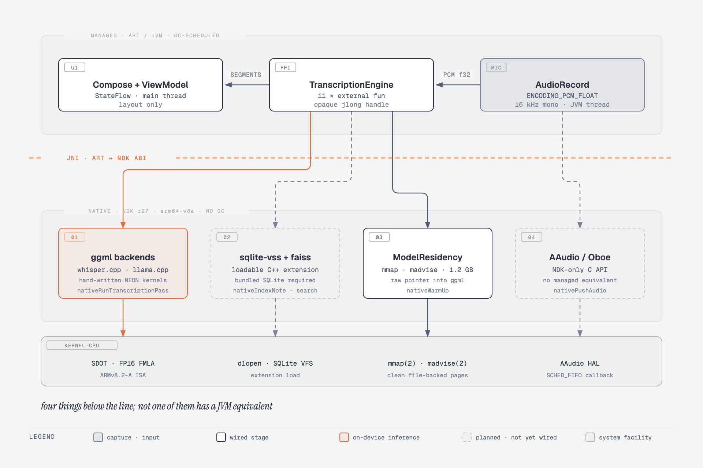

# Architecture decision records

Short, dated notes on the choices that are expensive to reverse.

## Overview — the managed/native boundary

Every ADR below rests on one premise: part of this product cannot run above the
JVM. That premise is worth stating precisely, because it is narrower than "we
write system-level C++" and it does not depend on the unfinished work landing.

  

Four requirements sit below the line, and none of them has a managed
equivalent:

1. **ggml backends.** whisper.cpp and llama.cpp carry hand-written ARM
   intrinsics — `SDOT`, `UDOT`, FP16 `FMLA`. No JVM path emits them. The
   managed-language alternatives (ONNX Runtime, LiteRT, MediaPipe) are
   themselves `.so` files crossing the same ABI; they stop you *writing* C++,
   not *shipping* it.
2. **sqlite-vss.** Vector search is a loadable C++ SQLite extension over faiss.
   Android's platform SQLite does not permit extension loading, and Room and
   SQLDelight both sit on top of it — so on-device ANN means bundling SQLite.
3. **Model residency.** `FileChannel.map()` does give Kotlin an `mmap`, but it
   caps a single mapping at `Integer.MAX_VALUE` and exposes no `madvise`; ggml
   needs a raw pointer into the mapping regardless.
4. **AAudio capture.** An NDK-only C API. `AudioRecord` is the managed
   counterpart and is what runs today.

Solid strokes in the diagram are wired and verified on device; dashed strokes
are designed and not yet linked. The distinction matters for planning, not for
the premise — the requirement is a property of the libraries and the platform,
not of how much of the pipeline is finished.

Note that the premise is carried by the code this repository *links*, not by
the ~1,100 lines of first-party C++ it contains. That C++ exists to reach the
libraries above and to share one implementation with iOS (ADR-001); its system
API surface is a single `mmap` wrapper. Claiming more than that is claiming
something the tree does not support.

## ADR-001 — One shared C++ core, two native UIs (not a cross-platform UI)

whisper.cpp and llama.cpp are the only part of this product where platform
parity genuinely matters — the inference math is identical on both devices and
duplicating it would guarantee divergence. The UI is the opposite: a recording
app lives or dies on its audio session handling, its background behaviour and
its scroll performance, all of which are platform-specific in ways a
cross-platform toolkit abstracts away exactly where you need the control.

So the seam is drawn at the inference boundary, not above it.

## ADR-002 — Swift-C++ Interop instead of an Objective-C++ wrapper

The traditional bridge is a `.mm` file exposing an `@objc` class. That costs a
third hand-written API surface to keep in sync, forces every value type through
`NSObject`, and adds an ARC round trip per call.

Swift 5.9+ imports C++ directly. The cost is a discipline constraint: the
public headers must stay inside the subset the importer can model (see the
header comment in `Types.hpp`). That constraint is cheap to hold and it is
checked by the compiler, which a hand-written wrapper never is.

## ADR-003 — Values in, values out; no callbacks across the bridge

`std::function` is not importable into Swift, and a C-function-pointer callback
leaves the question of which thread — and on Android, which `JNIEnv` — the
callback arrives on. `drainSegments()` returns a vector instead. The UI polls a
cheap, lock-guarded queue; the engine never reaches upward.

## ADR-004 — mmap, never read

See the Memory Management section of the root README. The short version: a
`read()` GGUF is dirty anonymous memory and counts fully against the process
footprint; an `mmap()` GGUF is clean, file-backed and evictable.

## ADR-005 — Schema defined in C++, not in Core Data or Room

Two ORMs generating two schemas from two model files is a divergence with a
long fuse. `core/database/include/scribatic/db/Schema.hpp` is the only DDL in the
repository, and both platforms execute it verbatim.

## ADR-006 — The product is retrieval over your own history, not transcription

Dated 2026-09-15, after surveying what already ships.

On-device transcription is no longer a differentiator. Apple Voice Memos does it
on every iPhone 12 or later: on-device, live while recording, searchable across
every recording, summarised by Apple Intelligence. Several third-party apps
(Whisper Notes, Aiko, Whisper Transcription, Whisperer) ship the same
whisper-on-device pitch for a one-off single-digit price. Competing there means
out-executing Apple on a feature Apple gives away.

What nobody ships is the other half: asking a question in natural language and
getting an answer drawn from your entire recording history, computed entirely on
the device. Apple's search is keyword-only and cannot answer "what did we decide
about pricing?". Plaud's "Ask Plaud" does exactly this and sends everything to a
server to do it. That gap — semantic retrieval across a personal corpus with no
network path — is the product.

So transcription is demoted to the ingestion pipeline. It still matters, and
whisper.cpp stays, but it is now judged on whether it produces text worth
indexing rather than on how fast a word appears on screen.

Three consequences follow, and they reverse earlier choices:

1. **Transcribe after the recording stops, not during it.** The five-second
   decode window was whisper doing what whisper is worst at: it loses context at
   every boundary and emits non-speech markers for the gaps. Every other
   whisper-based app transcribes the finished file for exactly this reason, and
   the extra context matters more when the output is being embedded than when it
   is being watched. Live captioning needs a streaming-architecture model, which
   is why Apple can do it and whisper cannot.

2. **Import is a first-class entry point, not a convenience.** Retrieval is
   worth nothing over a corpus of one. Most people already have years of audio
   in Voice Memos and elsewhere, and importing it is how a new user gets a
   history worth querying on the first day.

3. **Persistence stops being optional.** A transcript that dies with the screen
   cannot be retrieved from later. `notes`, `segments`, `chunks`, `vss_chunks`
   and `chunks_fts` move from defined-and-unused to the centre of the product.

The unwired halves — llama.cpp and SQLite-VSS — are therefore no longer the
part to do last. They are the part that makes this a product rather than a
cheaper Voice Memos.

## ADR-007 — Qwen3 1.7B and all-MiniLM-L6-v2, both Apache 2.0

Dated 2026-09-15. Two models had to be chosen before retrieval could be built.

### The embedding model was almost decided already

`Schema.hpp` fixes `kEmbeddingDims = 384` and the virtual table is declared
`vss0(embedding(384))`. That number is load-bearing: changing it is a schema
migration, not a config edit. `all-MiniLM-L6-v2` emits exactly 384 dimensions
from a 22.7M parameter encoder, runs CPU-only, and is Apache 2.0. At Q8_0 it is
about 25 MB — small enough that quantising it further would trade recall for
almost nothing.

### The instruct model was chosen on licence first, benchmark second

This ships inside a paid-capable App Store and Play app, so the terms matter
more than a leaderboard position:

| Model | Licence | Gated | Q4_K_M |
|---|---|---|---|
| **Qwen3 1.7B** | Apache 2.0 | no | ~1.2 GB |
| Phi-4-mini 3.8B | MIT | no | ~2.3 GB |
| Llama 3.2 3B | Llama Community Licence | yes | ~2 GB |
| Gemma 3 1B | Gemma Terms of Use | yes | ~0.8 GB |

Llama and Gemma both carry custom terms with use conditions, and both are gated
downloads requiring an account token — which would put a credential in the path
of `make fetch-models`. Apache 2.0 and MIT impose no field-of-use restriction
and no revenue clause; compliance is satisfied by shipping the licence text in
an "Open Source Licenses" screen, which is required whether the app is free or
paid.

Qwen3 1.7B over Phi-4-mini on size: the README targets 4 GB Android devices,
and 1.2 GB of weights alongside a 141 MB acoustic model leaves headroom that
2.3 GB does not.

The GGUF is taken from `ggml-org`, the llama.cpp organisation's own account,
rather than a third-party requantisation — the same provenance argument as
vendoring the backends from upstream rather than a fork.

### Consequences

`EngineConfig` gains a third path. An instruct model is a poor embedder and
does not emit 384 dimensions, so the two are separate GGUFs and separate
contexts, not one model serving both purposes.

Total resident weights become roughly 1.4 GB: 141 MB whisper, 25 MB embedder,
1.2 GB instruct. This is the pressure ADR-004 exists to manage — mapped clean
and file-backed, evictable under memory pressure, never `read()` into dirty
anonymous pages.

Weights are downloaded on first run rather than bundled. A 1.2 GB app binary is
hostile to install and awkward against store limits, and every comparable
on-device LLM app does the same. That makes the first-run download real product
surface: progress, resumability, a Wi-Fi preference, and a failure path.

## ADR-008 — Retrieval is the only edge, and it is not yet built

Dated 2026-09-23, after surveying what actually ships on Play. ADR-006 argued
from Apple Voice Memos that transcription is not a differentiator. Two apps in
the store now make that concrete, and they fail in opposite directions.

### The ground either side of this product is already occupied

| | CraftNote (`com.joyolabs.noteify`) | Notely Voice (`com.module.notelycompose.android`) |
|---|---|---|
| Transcription | cloud | on-device whisper |
| Reach | ~470K installs, 4.64★ / 37K ratings | Play + F-Droid, Android + iOS |
| Price | subscription | free, GPL-3.0; subscription rebuild on Play |
| AI layer | summaries, speaker ID, to-dos | none |
| Search | keyword | keyword |
| Privacy basis | policy | architecture |

CraftNote's own privacy policy is explicit that audio leaves the device: it
hands a Cloudflare R2 URL to ElevenLabs Scribe V2, Whisper, Groq Whisper or
Google Gemini and the provider fetches it. The promise is "encrypted, never
sold, never trained on" — a commitment about conduct, not a property of the
system. That is the distinction this product sells against, and it only holds
while there is genuinely no network path.

Notely Voice is the harder comparison, because it is close to this
architecture already shipped: Compose Multiplatform on both platforms, whisper
on-device, no cloud, 100+ languages, actively maintained, and free. It is a
second proof of ADR-006 rather than a threat to it — but it also ships rich
text, folders, tags, filtering, audio import, playback and export, all of which
this repository does not have, in a 20 MiB APK.

So on everything built so far, this product is behind both. That is the honest
starting position.

### What neither of them does

Notely Voice's search is keyword only. No embeddings, no vector index, no
retrieval-augmented generation, no local instruct model, no summarisation.
CraftNote has the AI layer and reaches it over the network.

The intersection — CraftNote's capability with Notely's privacy basis — is
unoccupied. It is unoccupied because it is the expensive square, not because
nobody has thought of it. Hobby repositories already pair whisper, embeddings
and a local LLM on Android; none has shipped it as a product.

### This is where the shared C++ core starts paying

Notely Voice reaches whisper through Kotlin Multiplatform bindings and never
needed a C++ core. On transcription alone, ADR-001 buys little that KMP does
not. Its value appears when llama.cpp, an embedder and sqlite-vss have to share
state and a lifetime — three C++ dependencies that are materially harder to
wire twice, in Kotlin and in Swift, than once underneath both.

The architecture bet and the product bet are therefore the same bet, and both
rest on the unbuilt half.

### Definition of done

Ask a question in natural language; get an answer drawn from three recordings
made in three different months, each cited; with the device in airplane mode.

Neither competitor can do this. Until it works, there is no differentiator to
describe, and the correct description of this product is "a less complete
Notely Voice".

### Consequences

1. **Transcription is judged only on whether it produces text worth indexing.**
   No further investment in the capture or decode path beyond correctness —
   ADR-006 already demoted it; this fixes the budget.
2. **Import moves up.** Notely Voice already has it, and retrieval over a
   corpus of one is worthless. It is both table stakes and a prerequisite for
   the only feature that differentiates.
3. **The free GPL competitor anchors the transcription half at zero.** Whatever
   is charged for must be the retrieval layer. A paid app whose paid-for
   feature is transcription cannot be defended.
4. **Three risks are accepted knowingly.** ~1.4 GB of weights against a 20 MiB
   competitor makes first-run download real product surface (ADR-007). Qwen3
   1.7B over retrieved chunks on a 4 GB device will be slow, and a confidently
   wrong answer about what someone said is worse than a keyword search that
   returns nothing. And the moat is thin: Notely's SQLDelight stack could add
   an embedder and a vector index without a rewrite.
5. **The window is finite.** Apple Intelligence already summarises in Voice
   Memos, and AICore/Gemini Nano is the same move on Android. The unserved
   thing is semantic retrieval across a personal corpus with no network path —
   and that is unserved now, not indefinitely.

## ADR-009 — Speakers per note, on device, and no voiceprint outlives a recording

Dated 2026-09-26. Asked for by prospective education users: record a
discussion between several people, get a transcript that says who said what,
share it, and delete the audio while keeping the words.

### Diarization is sherpa-onnx, prebuilt, behind the C API

Who-spoke-when is two models: pyannote segmentation 3.0 (MIT) finds speech and
changes of voice, and a speaker-embedding model turns each stretch into a vector
that is clustered into speakers. sherpa-onnx runs both through ONNX Runtime and
exposes a plain C API, which the shared core calls; nothing on either platform
side knows diarization exists beyond `identifySpeakers()`.

It is linked as a prebuilt binary, pinned by version and SHA-256 in
`scripts/fetch_native_deps.sh`, rather than vendored as source: building ONNX
Runtime for three targets is a project of its own. The cost is size — about
27 MB of native code on Android (`libonnxruntime.so` + `libsherpa-onnx-c-api.so`)
and a 26 MB dynamic framework on iOS — plus 32 MB of models. The build is
optional: without the library the core compiles a stub and the UI hides the
feature.

### The embedding model and threshold were chosen by measurement

Three English embedding models were run over sherpa-onnx's real two-speaker
recordings and over synthetic three- and four-voice discussions:

| Model | Told "2 speakers" | Estimating |
|---|---|---|
| CAM++ (VoxCeleb) | collapsed one clip into a single 24 s turn | 3–4 speakers for 2 |
| WeSpeaker ResNet34 | clean on one clip, **one speaker** on the other | 1 speaker for 2 |
| **ERes2Net (VoxCeleb)** | clean alternation on every clip | depends on threshold |

For estimating the count, ERes2Net at a cosine threshold of 0.85 got every
two-person clip right but merged two of four voices; at 0.7 it kept all four
apart and sometimes split one person into two. **0.7 is used**, because the two
failure modes are not symmetric: a person split in two is repaired by giving
both labels the same name (the export merges them), while two people merged
into one label cannot be repaired at all. When the count is known, the user can
say so ("Identify speakers again → 3 people"), which bypasses the estimate.

### Attribution is per word, not per segment

Whisper segments on pauses, not on voices, and a segment regularly spans a
change of speaker. Labelling whole segments put one person's reply in the
other's mouth. So the engine keeps word timings and re-cuts segments wherever
the speaker changes.

Two details were found by running it, not by designing it:

- **Word timings come from whisper's DTW alignment** (`dtw_token_timestamps`),
  not the default timestamp heuristic, which drifted by hundreds of
  milliseconds exactly at turn boundaries. DTW is silently disabled by flash
  attention, which is on by default, so flash attention is off. The alignment
  scratch is 32 MB rather than the 128 MB default; 8 MB was measured to suffice
  for the 5 s decode window.
- **A word counts for at most 700 ms from its onset.** Stored spans run onset
  to next onset, so the last word before a pause stretched across the pause and
  was attributed to whoever spoke next.

### What is stored, and what is not

Word timings are persisted (`words` table), so speakers can be re-identified
later with a different count — but only while the recording exists, because
diarization needs the audio. The UI identifies speakers immediately after
recording for that reason.

**No voiceprint is stored.** Embeddings exist only inside one `identifySpeakers()`
call. Speakers are per note: "Speaker 1" in one recording has no relationship
to "Speaker 1" in another, and naming someone is a label typed by the user, not
recognition. Recognising the same person across recordings would require
keeping a voiceprint, which is biometric data — and for recordings made in
schools, biometric data about children. That is a product decision to make
deliberately, with opt-in and consent, not a side effect of this feature.

### Deleting a recording keeps the transcript

`deleteRecording()` removes the file first and the reference second; a crash in
between leaves a reference to a missing file, which the next `warmUp()` clears.
`warmUp()` also deletes `recording-*.wav` files no note refers to — the leftovers
of a crash between capture and save. Notes store a recording's file name, never
its path: an iOS container moves on reinstall, which was observed during
verification.

Deleting must also mean deleting from backups. Android already excluded app
data; iOS did not, and `Application Support` is backed up to iCloud by default.
The database and recordings now live in `store/` and `recordings/`, both
excluded from backup, and the model files are excluded too.

### Sharing sends nothing

Share hands plain text to the system share sheet; the app the user picks does
any sending. No network permission or API is involved, and the no-network CI
check is unchanged. "Share without names" replaces every name with "Speaker N"
for sharing a discussion without identifying the people in it.

### Known limits

- Two similar voices can be merged. In the synthetic four-voice test, two
  female TTS voices were clustered together for one turn whatever the count or
  gap settings; real recordings of distinct people separated cleanly.
- Diarization is not cancellable part-way: sherpa-onnx ignores the progress
  callback's return value.
- Cost is roughly 3 s per 35 s of audio on an M4 and about 30 s per 41 s on an
  arm64 emulator. It has not yet been measured on a phone.
