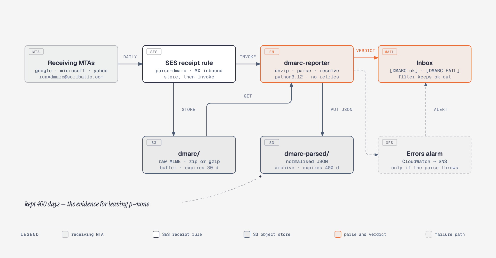

# DMARC aggregate reports

Reports are parsed in the cloud and arrive as readable mail. This folder is
now only a scratch area for reading one by hand — it is gitignored, not an
archive.

## Architecture overview

<p align="center">
  
</p>

<sub>Source: [`docs/diagrams/dmarc.html`](../../docs/diagrams/dmarc.html) · vector: [`dmarc.svg`](../../docs/diagrams/dmarc.svg)</sub>

`_dmarc.scribatic.com` publishes:

```
v=DMARC1; p=none; rua=mailto:dmarc@scribatic.com
```

The reports address is deliberately not the public contact address. A daily
report from every large receiver buries mail from actual people, and a
dedicated recipient is what lets SES route reports to a function that *reads*
them rather than the function that forwards `info@` onward.

The whole design turns on one observation: a zipped attachment nobody opens is
indistinguishable from no monitoring at all. The domain could be spoofed for a
month with the evidence sitting unread in a mailbox. So the archive is opened
in flight, and the answer is put where it cannot be missed — the subject line:

```
[DMARC ok]   google.com — 41 msgs, all aligned — 2026-09-15
[DMARC FAIL] Enterprise Outlook — 612 of 755 unaligned from 2 IPs — 2026-09-15
[DMARC unreadable] could not read a report — <message id>
```

## How a report is processed

Stages 3–8 are all [`infra/lambda/dmarc/index.py`](../../infra/lambda/dmarc/index.py);
the rest is [`infra/terraform/dmarc.tf`](../../infra/terraform/dmarc.tf).

1. **A receiver sends one.** Google, Microsoft, Yahoo and friends each mail one
   aggregate report per day covering every message that claimed to be from
   `scribatic.com`. The domain's MX points at `inbound-smtp.ap-southeast-2`,
   so SES takes delivery.

2. **The receipt rule stores, then invokes.** `parse-dmarc` matches on the
   recipient `dmarc@` and runs two actions *in that order* — the raw MIME
   message is written to the `dmarc/` prefix first, and only then is the
   function invoked. The order is load-bearing: the function reads the message
   out of S3, so it has to be there before anything runs.

3. **The reporter reads the message back.** SES passes a message id, not the
   mail; the object key is that id under `dmarc/`.

4. **It unwraps whatever actually arrived.** Zip, gzip, or bare XML, sniffed by
   magic bytes rather than by filename or declared content type — receivers
   mislabel both routinely, and `application/octet-stream` for a zip is
   common. One mail can carry more than one report.

5. **It evaluates every row.** A row passes DMARC if *either* aligned
   identifier passes, so SPF alignment failing on its own is expected here
   while SES owns the envelope sender. Namespaced XML is handled; so is the
   `reason` element mailing lists produce.

6. **It names the sources.** Each distinct source IP is reverse-resolved, so a
   row reads `…smtp-out.ap-southeast-2.amazonses.com` rather than a bare
   address — the difference between "ours" and "not ours" at a glance. All
   lookups run concurrently under a single 20-second deadline; anything slower
   is simply left blank rather than delaying the report.

7. **It archives the parsed form.** Normalised JSON lands under
   `dmarc-parsed/`, keyed by day and report id, and is kept for 400 days. The
   raw mail is a buffer and expires after 30.

8. **It mails the verdict.** Plain text and HTML, failing sources sorted to the
   top with their PTR records and the underlying DKIM and SPF results — and
   the pass/fail already in the subject.

9. **If any of that throws**, the function mails `[DMARC unreadable]` with the
   traceback and the S3 key, then re-raises so the CloudWatch alarm fires too.
   Async retries are disabled on the function, so one bad report produces
   exactly one alert rather than three.

## Set up the inbox filter

Do this once, or the reports are still noise — just readable noise.

**Filter out the clean days, and let everything else fall through to the
inbox.** Filtering the other way round — matching `FAIL` and routing it
somewhere — fails in the wrong direction: a subject variant nobody predicted
would be filed away silently, which is the exact failure this pipeline exists
to prevent. Matching only what is known-boring means anything unrecognised
lands in front of you.

One filter is enough:

| Field | Value |
| --- | --- |
| Has the words | `subject:"[DMARC ok]"` |
| Do this | Skip the Inbox, Apply label `dmarc`, Mark as read |

Optionally, a second to make failures louder — it changes nothing about
whether you see them, only how hard they are to miss:

| Field | Value |
| --- | --- |
| Has the words | `subject:"[DMARC FAIL]"` |
| Do this | Star it, Mark as important, Never send it to Spam |

### Gmail specifics that matter here

- Put the query in **Has the words**, not **Subject**. Only that field takes
  the full search syntax (`subject:`, quoted phrases, `OR`, parentheses).
- `OR` must be capitalised. Lowercase `or` is treated as a search term.
- **Gmail ignores `[`, `]` and `?`.** `subject:"[DMARC ok]"` really matches the
  phrase `DMARC ok`, which is still distinctive enough. But it is why the
  unreadable-report marker is the word `unreadable` and not `?` — a `?` would
  be stripped, leaving `subject:DMARC`, which matches every report there is.
- Type the query into the search bar first and check what comes back, *then*
  use **Show search options → Create filter**. The dialog gives no preview, so
  verifying before committing is the difference between a filter that works
  and a filter that quietly archives everything.

## When a `[DMARC FAIL]` arrives

The mail lists every failing source with its PTR record. Read that first:

- `*.smtp-out.ap-southeast-2.amazonses.com` — us. If DKIM shows `fail` for our
  own SES, something is wrong with the signing config, not with a spoofer.
- Anything else is either a third-party sender nobody wrote down (a newsletter
  tool, a ticketing system, a CI notifier) or somebody spoofing the domain.
  Legitimate senders get added to SPF or given their own DKIM selector;
  spoofers are the reason to tighten the policy.

`forwarded` in the reason column is benign — mailing lists break SPF and DKIM
alignment as a matter of course.

## Reading one by hand

Raw report mail is kept in S3 for 30 days:

```sh
aws --profile personal s3 ls s3://scribatic-com-mail-<account>/dmarc/
aws --profile personal s3 cp s3://scribatic-com-mail-<account>/dmarc/<key> - | less
```

Or, for a `*.zip` dropped in this folder:

```sh
unzip -p 'google.com!scribatic.com!*.zip' | xmllint --format -
```

Per `<record>`, the things that matter:

- `<source_ip>` — who sent it.
- `<policy_evaluated><dkim>` / `<spf>` — *alignment*, not whether the check
  passed. DMARC passes if either one is `pass`.
- `<disposition>` — what the receiver actually did.

## The parsed archive

Every report is also written as normalised JSON to `dmarc-parsed/`, kept 400
days. This is what answers the question the policy turns on — *have we had a
clean run long enough to tighten it?*

```sh
aws --profile personal s3 cp --recursive \
    s3://scribatic-com-mail-<account>/dmarc-parsed/ /tmp/dmarc/
jq -r 'select(.failed > 0)
       | [.begin, .org, .failed, .total] | @tsv' /tmp/dmarc/*/*.json
```

No output means no unaligned mail in the retained window.

## Current sending setup

- SPF: `v=spf1 include:amazonses.com ~all`
- DKIM: SES-managed, signs as `scribatic.com` — aligns, so DMARC passes.
- SPF alignment fails by design: the envelope sender is
  `ap-southeast-2.amazonses.com`. Fixing that needs a custom MAIL FROM domain
  configured in SES (e.g. `mail.scribatic.com`). Until then, every report will
  show `spf fail` on our own traffic and still pass DMARC on DKIM alone.

Policy is still `p=none` (monitor only). Move to `p=quarantine` and then
`p=reject` once the parsed archive shows a clean run with no unexpected
sources.

## Deploying, and the two confirmation clicks

```sh
cd infra/terraform && terraform apply
```

Two things need a human afterwards, and nothing works until both are done:

1. **SNS** mails a subscription confirmation to the destination inbox. Click
   it, or the error alarm below is silent.
2. Receivers pick up the new `rua=` address on their own schedule — expect
   reports at `dmarc@` within a day or two. Until then they keep arriving at
   `info@` as raw attachments.

## What is still a gap

`scribatic-dmarc-reporter` throwing would produce silence, and silence looks
exactly like a run of clean days. A CloudWatch alarm
(`scribatic-dmarc-reporter-errors`) covers the function *failing*, and the
function mails `[DMARC unreadable]` itself before re-raising on a report it cannot
parse.

Neither covers reports never arriving at all — a broken MX, a receipt rule
disabled, a receiver dropping us. That needs a scheduled check that
`dmarc-parsed/` gained objects in the last 36 hours, and it is not built yet.
